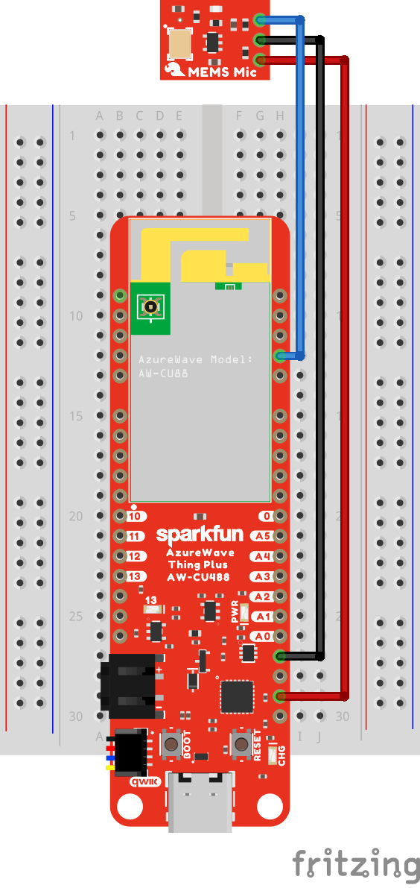

# AIoT doorbell notifier example for Ameba

Combine real-time audio, AI/ML, DSP, and Wi-Fi connectivity technologies together to get notified when your doorbell rings while you're away.

Please see the ["ML powered doorbell notifier with the Realtek RTL8721DM" guide on Hackster.io](https://www.hackster.io/sandeep-mistry/ml-powered-doorbell-notifier-with-the-realtek-rtl8721dm-0a781e) for an overview of the project and step by step setup instructions.

## Hardware

 * [SparkFun AzureWave Thing Plus - AW-CU488](https://www.sparkfun.com/products/19957)
 * [SparkFun Analog MEMS Microphone Breakout - SPH8878LR5H-1](https://www.sparkfun.com/products/19389)

### Wiring

| SparkFun AzureWave Thing Plus | SparkFun Analog MEMS Microphone Breakout |
| ----------------------------- | ---------------------------------------- |
| 3V3 | VCC |
| GND | GND |
| 22 (PA4) | AUD |

## License

[MIT](LICENSE)

---

Disclaimer: This is not an official Arm product.
